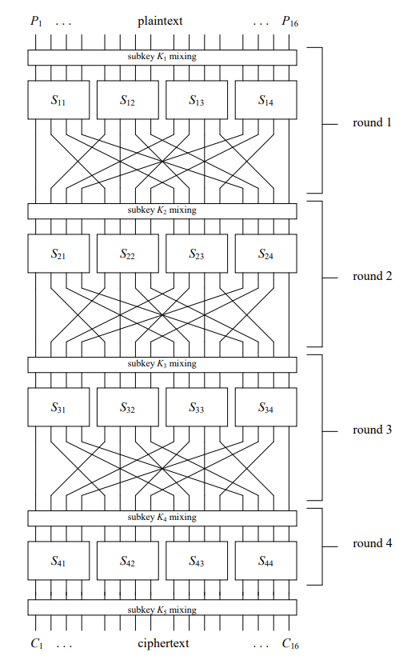
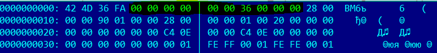

# SePtoN

Encrypted images storage service. Written in Swift 5.

Client (checker) connects to SePtoN over TCP, exchanges key using Diffie–Hellman protocol, encrypts his BMP image with flag using custom Substitution-Permutation algorithm and sends encrypted image to the service.
Service then decrypts image, performs smoke-checks that it is valid BMP, embeds watermark-message in last bits of pixel data, encrypts resulting image and stores it to filesystem, responding to client with file id.
When checker retrieves encrypted image file back from the service, it decrypts file and checks whether the resulting image is still similar to the one he sent (flag is still painted on the image and is still readable).

Service listens TCP-port 31337 for putting flags to it and TCP-port 31338 for getting flags from it.

## Vuln in Substitution-Permutation cipher

Service uses custom Substitution-Permutation cipher algorithm in CBC mode, like one on the image (but with randomized permutation connections)

Block size and master Key size is 64bits. Cipher uses 16 S-Boxes taken from standard implementations of [GOST 28147-89](https://ru.wikipedia.org/wiki/%D0%93%D0%9E%D0%A1%D0%A2_28147-89) cipher. P-Box is chosen randomly. Round keys are generated from master-key ROL-ing it for 2 bytes each round.

This cipher has only 4 rounds of encryption so it is vulnerable to [Linear Cryptanalysis](https://www.engr.mun.ca/~howard/PAPERS/ldc_tutorial.pdf).

## Exploiting
Checker posts images in BMP format with 32bits per pixel: 3 bytes per R, G and B channel, one more byte is for alpha-channel and in fact is always 0xFF in checker-generated images, thats why attacker knows each fourth byte of the plaintext.
Images posted by checker are roughly 64Kb in size, so hacker has 64Kb / 8b = 16k pairs of (partly_known_plaintext, ciphertext).
Now hacker needs to analyse S-Boxes and find suitable linear approximations with biggest bias and with inputs corresponding to known parts of the plaintext.
Then hacker performs Linear Cryptanalysis using best found approximations and finds most of the last round subkey bits. Hacker also needs to notice that last round subkey is exactly equal to master key because of the cipher's key shedule. So hacker can easily brute rest key bits, knowing the BMP image header standard header content.

See the exploit [here](https://github.com/HackerDom/proctf-2019/tree/master/checkers/SePtoN/SePtoN_Exploit).

## Patching

Because checker needs to decrypt image to check that flag is still there, cipher algorithm can't be changed to something more secure. But hacker needs to have lot's of (partly_known_plaintext, ciphertext) pairs to perform Linear Cryptanalysis. Because image is altered by SePtoN when it embeds watermark, checker has to perform not byte-exact comparison with expected flag image, but validate it as an image. So removing alpha-channel, or changing image format to some less predictable like PNG easily patches the service.
