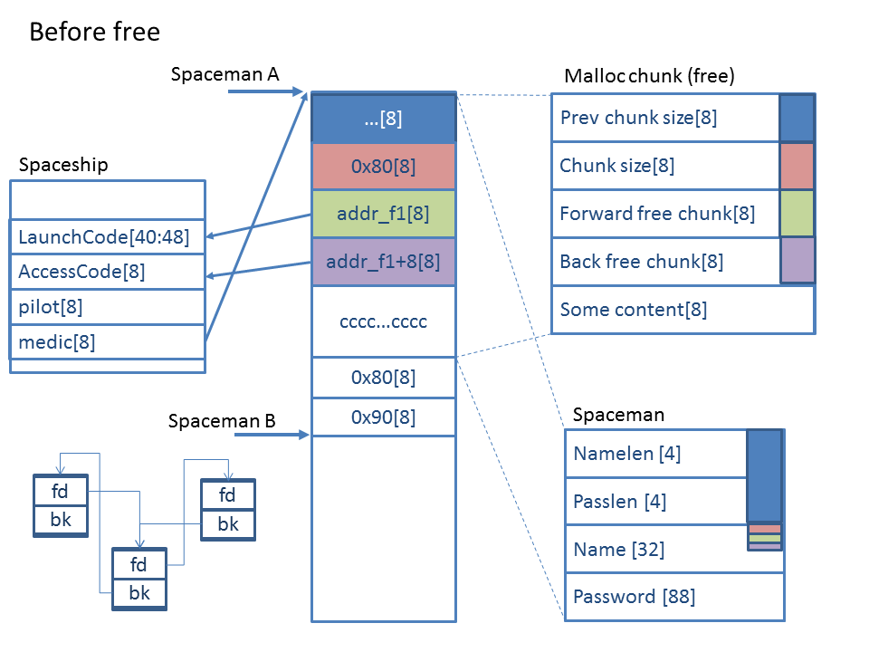
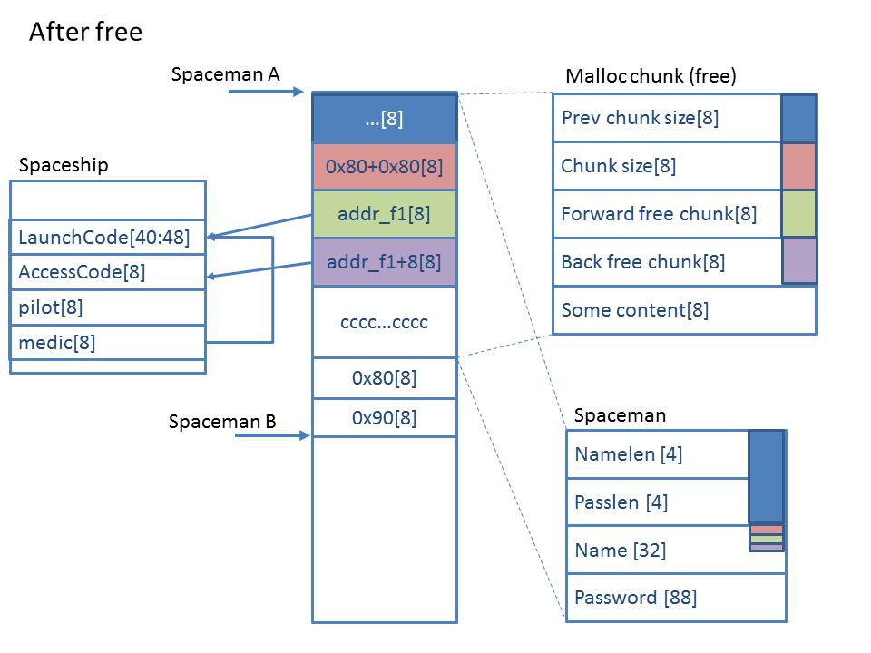
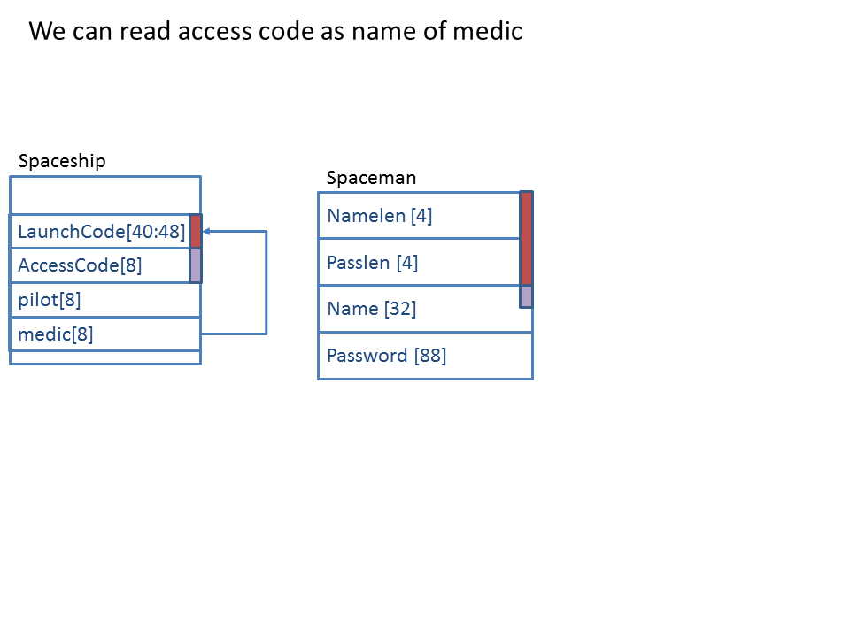

# Spaceships writeup

## Description

Given the binary serv13. It was run with socat on port 3777 as tcp-service. The goal is to get flags.

## Where flags are placed

After connectoin service prints its menu. 

    Commands:
    1.Add spaceship
    2.Add spaceman
    3.Delete spaceship
    4.Delete spaceman
    5.Edit spaceship
    6.View spaceship
    7.View man info
    8.Edit man info
    9.View launch code
    10.Store spaceman
    11.Load spaceman
    12.Search spaceman
    13.Store spaceship
    14.Load spaceship
    15.Search spaceship

This commands manipulates with 32 slots for spaceships and 32 slots for spacemans. 
Spaceman and spaceship structures are next

    typedef struct __attribute__ ((packed)) _Spaceship {
        char Name[40];
        char LaunchCode[48];
        char AccessCode[8];
        Spaceman * pilot;
        Spaceman * medic;
        Spaceman * engineer;
        Spaceman * Capitan;
    } Spaceship;
    typedef struct __attribute__ ((packed)) _Spaceman {
        unsigned int name_len;
        unsigned int password_len;
        char Name[32];
        char Password[88];
        _Spaceship * ship;
    } Spaceman;

You can create and delete new Spaceship or Spaceman, edit information about Spaceship or Spaceman, remove
Spaceship or Spaceman. Also you can save this structs to disk (file in appropriate folder) and load it from disk
by name. Name of file is related with name of Spaceship or Spaceman. If such file already exists then you cannot
save it. If AccessCode for Spaceship is not yet installed then you can install it. Access code is asked when you try to 
view launch code. 

Flags are stored in Launch code fields of spaceships and protected with password which stored int Access code 
fields.

Source code is presented  [here](/13.cpp)

## Vulnerabilities

1. After deletion of Spaceman link in static array 'spacemans' not deletes (line 60). And also during allocation
of Spaceman zero in slot of 'spacemans' array not verifies, memory does not initializes with zero (lines 47,51).

2. After deletion of Spaceship its content does not deletes. 

3. Bounds of allocation slots for 'spacemans' and 'spaceships' arrays does not verifies - you can use any index.

4. In cas of incorrect access code it prints correct code.

Using this vulnerabilities player can get access code by next algorithm:

1. Allocate 9 Spacemans with arbitrary name and password
2. Allocate 10th and 11th Spacemans (let us call it A and B)
3. Load the spaceship from disk which has required flag
4. Using edit spaceship command make A spaceman to be a pilot, medic, engineer, Capitan of this spaceship
5. Delete spaceman A
6. View spaceman A info - it works because field did not nullified
7. At name field we can get some bytes. Convert it to number and subtract 11040. Record it as addr_f1
8. Allocate new Spaceship in slot 1. Set name to 'ZZzzzzz'.
9. Delete spacemans 0-9 (to clear tcache of heap)
10. Edit spaceman A name with next conten

        a1 = b"a" * 0x0                  # prev size
        a1 += pack("<Q",0x80)       # fake chunk size
        a1 += pack("<Q",adr_f1)     # address of forward free
        a1 += pack("<Q",adr_f1+8) # address of backward free
        a1 += b'c' * (0x80-4*8)       # fill
        a1 += pack("<Q",0x80)       # prev chunk size
        a1 += pack("<Q",0x90)       # chunk size, prev is free
        a1 += b'd'*8                       # fill

11. Delete spaceman B
12. View spaceship at slot 0. Instead of medic name you can see the launch code
13. View Launch code of spaceship 0 using this access code.

## Explanation of vulnerability

Vulnerability idea was taken from [this](https://webcache.googleusercontent.com/search?q=cache:fwf5-Z-5GiQJ:https://heap-exploitation.dhavalkapil.com/attacks/unlink_exploit.html+&cd=1&hl=ru&ct=clnk&gl=ae&client=firefox-b-d).
Look at next image . Memory state before 11 step is presented. In data field of Spaceman A segment a fake free chunk was crafted. Its next and back free segments points to some fields of memory. This field has next properties:

1. Spaceman A->forward_free_chunk + 8*3 = Spaceman A
2. Spaceman A->backward_free_chunk + 2*8 = Spaceman A

It is required to pass the "corrupted double-linked list" security check: P->fd->bk == P and P->bk->fd == P.

As we starts to free Spaceman B chunk we takes size of previous chunk (0x80) and see that crafted chunk is free. So we must unlink this chunk from double-linked list of free chunk to merge it with Spaceman B. Unlink function calls and next actions excutes:

1.    Set P->fd->bk = P->bk.
2.    Set P->bk->fd = P->fd.

At next image the result is shown 
Now medic reference in Spaceship refers to the last 8 butes of launch code field. As 
we can see at next image, now the name field of medic Spaceman contains the launch code and when we prints info about this spaceship we can see access code at medic name. 
