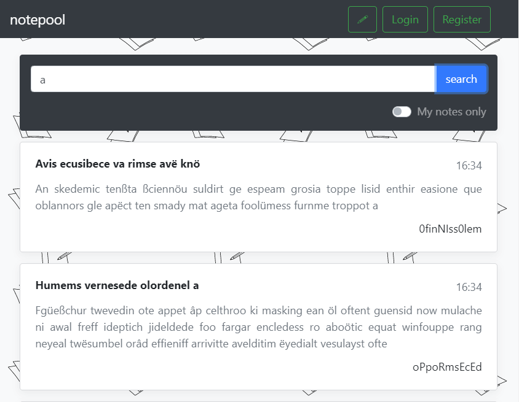

# notepool
Notepool is a web service that serves notes online. There are public and private notes with a full-text search based on Lucene.net library.



The HTTP handlers are:
* `/auth/signup` — user registration;
* `/auth/signin` — user login;
* `/notes/add` — create a new note;
* `/notes/search` — full-text search of added notes;

Users can create public notes that can be searched by everyone. Logged in users can search their private notes.
Also users can search or view all of their own notes by using `myOnly` flag. Hackers should get access to private messages of other users.

## Vulns

*There is a trivial unintended vulnerability — the lack of user name and password validation/escaping for line breaks which makes it easier to hack the service.*

### Lucene query syntax injection

The main vuln is Lucene query syntax injection through user login that is not fully escaped because of the validation.

But there are other vulnerabilities that allow to bypass the validation and use something like `LOGIN OR /[a-z0-9]{32}/` where `/[a-z0-9]{32}/`
is a regular expression that matches hashes of words used to save private messages. So the full request to Lucene will be
`((SOME TEXT) OR (HASH_OF_SOME HASH_OF_TEXT)) login:LOGIN OR /[a-z0-9]{32}/`.

```cs
var escapedText = text.TrimToNull().EscapeText() ?? EmptyRequest;
var escapedLogin = (myOnly ? user?.Login.EscapeKeyword() : null) ?? EmptyRequest;

var query = parser.Parse($"(({escapedText}) OR ({escapedText.HashWords(user?.Key)})) login:{escapedLogin}");
```
Source: https://github.com/HackerDom/proctf-2019/blob/master/services/notepool/src/LuceneIndex.cs#L118

### Race condition

User profiles are stored in text files, one field per line. User registration process generates a new user profile with user login serving as a name of the file.

There can be multiple parallel requests that try to register a new user with the same name. If such happened multiple threads gain
access to one file and write to it concurrently because of `FileMode.OpenOrCreate` and `FileShare.ReadWrite`.

Source: https://github.com/HackerDom/proctf-2019/blob/master/services/notepool/src/users/UserManager.cs#L46

There is a lock pool class used to synchronize access to files between threads. The concrete semaphore object is retrieved by the hash of `login`.

But there is an another bug which allows to bypass thread synchronization.

### Unicode handling inconsistency

Logins in service are case-insensitive. To get a filename of the user profile, login is converted to lowercase using the current locale.

But the hash of the login to get a synchronization object is calculated using invariant culture.

You can abuse this inconsistency by finding a pair of different characters such that:
1) they both match the [regular expression](https://github.com/HackerDom/proctf-2019/blob/master/services/notepool/src/controllers/AuthController.cs#L95)
`[a-z0-9_]`;
2) [char.ToLower](https://github.com/HackerDom/proctf-2019/blob/master/services/notepool/src/users/UserManager.cs#L29) returns the same value;
3) [InvariantCultureIgnoreCase.GetHashCode](https://github.com/HackerDom/proctf-2019/blob/master/services/notepool/src/AsyncLockPool.cs#L11)
returns different values;

Here is the code to find such pairs:
```cs
for(int i = 0; i < 0x10ffff; i++)
{
	if(i >= 0x00d800 && i <= 0x00dfff)
		continue;
	var c = char.ConvertFromUtf32(i);
	if(regex.IsMatch(c))
		Console.WriteLine("\\u{0:X4}:{1}:{2}:{3}", i, c, c.ToLower(), c.ToUpper());
}

Regex regex = new Regex("[A-Z]", RegexOptions.Compiled | RegexOptions.IgnoreCase);
```

As a result there are 2 chars that meet all the conditions:
```
\u0130:I:i:I
\u212A:?:k:?
```

So the full exploit is to concurrently register two users with names that differ in one character to get concurrent writes in one file which results in using name as login. And due to lack of validation the user name this leads to query syntax injection.

See the exploit here: https://github.com/HackerDom/proctf-2019/blob/master/sploits/notepool/src/Program.cs
